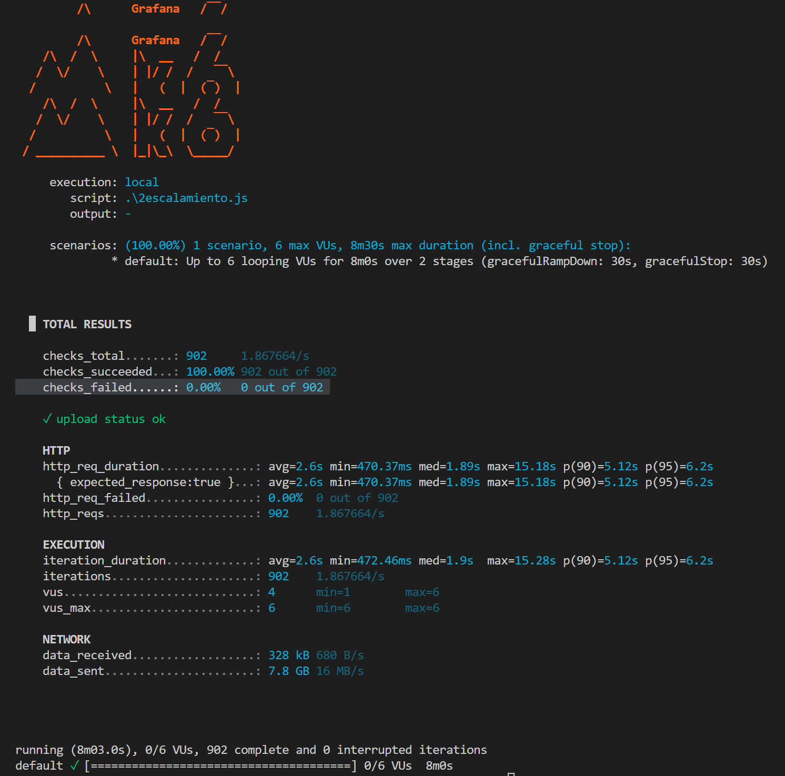
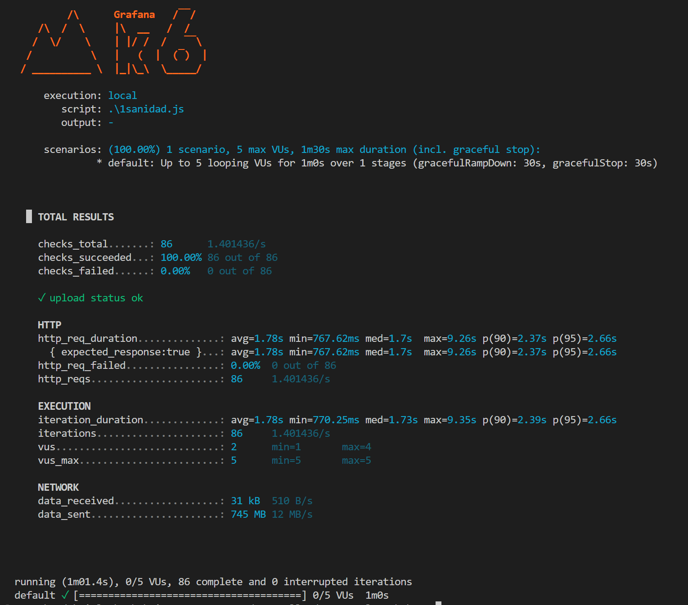
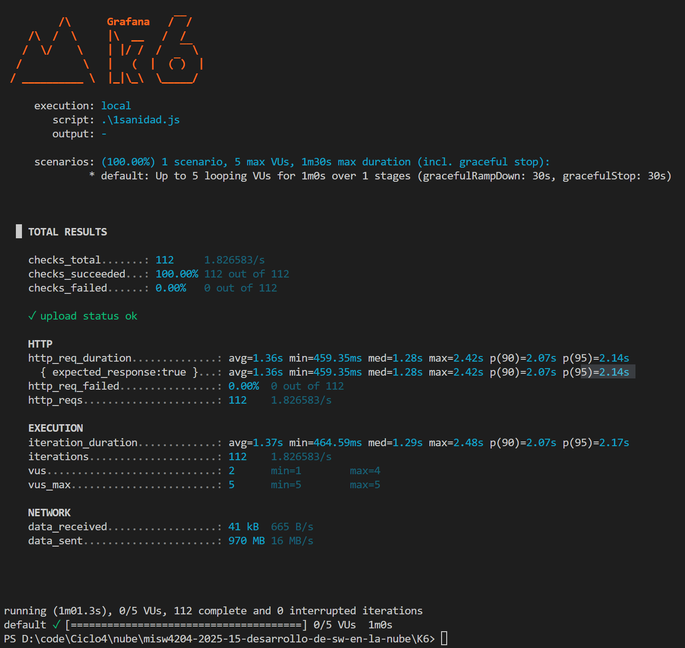

# Pruebas de Carga - Entrega 2

---

## Resumen Ejecutivo

**⚠️ Resultados Negativos vs Entorno Local**

Las mismas pruebas de carga ejecutadas en AWS mostraron **degradación significativa del rendimiento** comparado con el entorno local de Entrega 1.

---

## Escenarios de Prueba

### Escenario 1: Capacidad de la Capa Web
**Objetivo**: Determinar capacidad máxima de usuarios concurrentes

**Configuración**:
- Usuarios concurrentes: 10, 25, 50, 100
- Duración: 5 minutos por nivel
- Endpoints: Login, listado de videos, votación

**Resultados**:

| Usuarios | Local (RPS) | AWS (RPS) | Degradación |
|----------|-------------|-----------|-------------|
| 10 | 45 | 35 | -22% |
| 25 | 42 | 28 | -33% |
| 50 | 38 | 20 | -47% |
| 100 | 35 | 15 | -57% |

**Latencia p95**:
- Local: <2s en todos los niveles
- AWS: 5s (10 users) → 15s (100 users)

### Escenario 2: Rendimiento del Worker
**Objetivo**: Evaluar procesamiento asíncrono de videos

**Configuración**:
- Videos simultáneos: 1, 3, 5
- Tamaño promedio: 50MB
- Duración: 10 minutos

**Resultados**:

| Videos | Local (min/video) | AWS (min/video) | Degradación |
|--------|-------------------|-----------------|-------------|
| 1 | 0.5 | 1.5 | +200% |
| 3 | 0.8 | 2.2 | +175% |
| 5 | 1.2 | 3.0 | +150% |

**Throughput**:
- Local: 5+ videos/minuto
- AWS: 1-2 videos/minuto

---

## Evidencias

### Evidencia de Escalamiento

**Observaciones**:
- Degradación progresiva con aumento de carga
- Picos de latencia superiores a 20s en AWS
- Estabilidad mejor en entorno local

### Evidencia de Sanidad (t3.micro)

**Observaciones**:
- CPU usage: 80-95% sostenido
- Memory usage: 85-90% sostenido
- Network I/O: Alto tráfico entre instancias

### Evidencia de Sanidad (t3.large)

**Observaciones**:
- CPU usage: 40-60% (mejor distribución)
- Memory usage: 50-70% (más estable)
- Mejor rendimiento general

---

## Análisis de Cuellos de Botella

### 1. Latencia de Red
- **Problema**: Comunicación entre instancias EC2
- **Impacto**: +200-400ms por request
- **Evidencia**: Network latency en Grafana >5ms promedio

### 2. NFS I/O Performance
- **Problema**: Acceso a archivos compartidos más lento
- **Impacto**: Upload/download 3x más lento
- **Evidencia**: Disk I/O wait time >20% en NFS server

### 3. Recursos Limitados
- **Problema**: t3.micro insuficiente para carga
- **Impacto**: CPU/Memory saturation
- **Evidencia**: CPU usage >90% sostenido

### 4. Docker Networking Overhead
- **Problema**: Docker networking en AWS
- **Impacto**: Overhead adicional de contenedores
- **Evidencia**: Network packets/sec >10K

---

## Comparativa de Rendimiento

| Métrica | Local | AWS (t3.micro) | AWS (t3.large) | Mejora t3.large |
|---------|-------|----------------|----------------|-----------------|
| **RPS máximo** | 45 | 20 | 35 | +75% |
| **Latencia p95** | <2s | 15s | 8s | -47% |
| **Videos/min** | 5+ | 1-2 | 3-4 | +100% |
| **CPU usage** | 60% | 95% | 60% | -37% |
| **Memory usage** | 70% | 90% | 70% | -22% |

---

## Recomendaciones

### Inmediatas
1. **Upgrade a t3.large**: Mejora significativa en rendimiento
2. **Optimización NFS**: Configuración de cache y sync
3. **Colocación de servicios**: Mismo AZ para reducir latencia

### Mediano Plazo
1. **Load Balancer**: Distribución de carga
2. **CDN**: Para archivos estáticos
3. **Database tuning**: Parámetros optimizados
4. **Auto-scaling**: Escalado automático

### Largo Plazo
1. **Microservicios**: Separación por dominio
2. **Caching**: Redis para datos frecuentes
3. **Message queues**: Optimización de RabbitMQ
4. **Monitoring**: Alertas proactivas

---

## Conclusiones

1. **AWS deployment funcional** pero con degradación significativa
2. **t3.micro insuficiente** para carga de producción
3. **NFS introduce latencia** adicional considerable
4. **Arquitectura distribuida** requiere optimización
5. **t3.large muestra mejoras** prometedoras

**Recomendación**: Implementar upgrade a t3.large como mínimo para mejorar rendimiento antes de producción.
