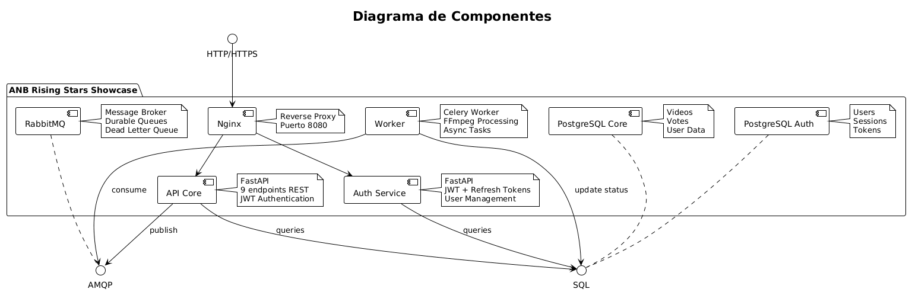
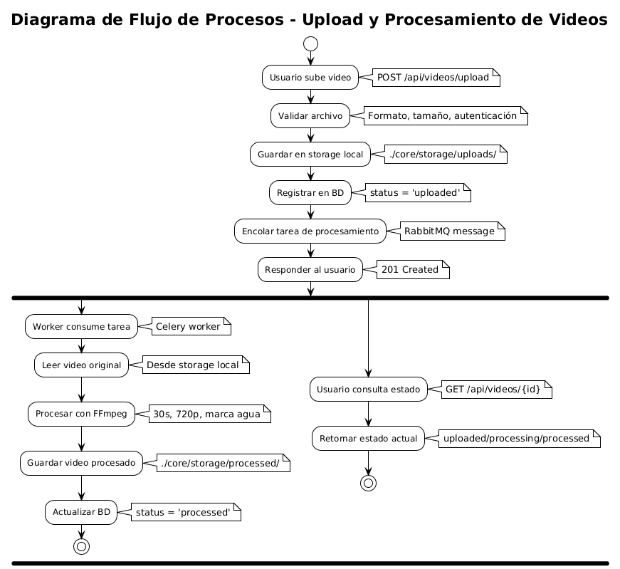
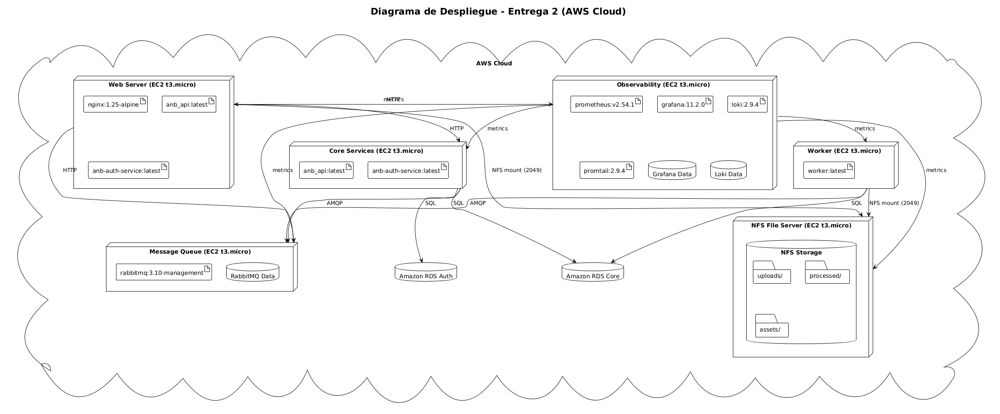

# Diagramas UML - Entrega 2

---

## Diagramas Requeridos por los Documentos de Entrega

### 1. Modelo de Datos (ERD)
**Requerido por:** Entrega 1 - "inclusión del modelo de datos de la aplicación, representado mediante un diagrama Entidad-Relación (ERD)"

### 2. Diagrama de Componentes
**Requerido por:** Entrega 1 - "representación de los principales elementos de la arquitectura, considerando backend, worker, broker y base de datos"

### 3. Diagrama de Flujo de Procesos
**Requerido por:** Entrega 1 - "descripción detallada de las etapas de carga, procesamiento y entrega de un archivo"

### 4. Diagrama de Despliegue
**Requerido por:** Entrega 1 - "representación de la infraestructura de ejecución (máquinas virtuales, contenedores Docker y servicios activos)"
**Requerido por:** Entrega 2 - "Es fundamental presentar tanto el modelo de despliegue como el modelo de componentes"

---

## Cumplimiento de Requisitos

### Entrega 1 - Documentación Requerida
- ✅ **Modelo de datos**: Diagrama Entidad-Relación (ERD)
- ✅ **Diagrama de componentes**: Principales elementos de arquitectura
- ✅ **Diagrama de flujo de procesos**: Etapas de carga/procesamiento
- ✅ **Despliegue**: Infraestructura de ejecución

### Entrega 2 - Documentación Requerida
- ✅ **Modelo de despliegue**: Arquitectura AWS con instancias EC2
- ✅ **Modelo de componentes**: Servicios distribuidos en AWS
- ✅ **Análisis de capacidad**: Pruebas de carga con evidencias
- ✅ **Documentación de arquitectura**: Diagramas UML estándar

